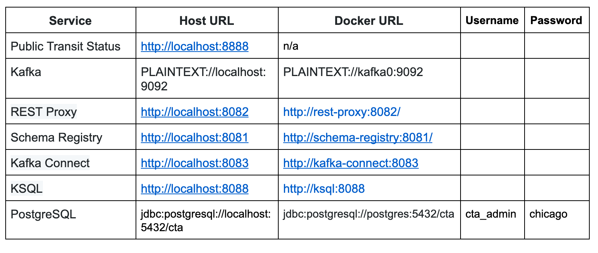

### Challenge

To construct a streaming event pipeline around Apache Kafka and its ecosystem. Using public data from the [Chicago Transit Authority](https://www.transitchicago.com/data/) to display the status of train lines in real time. The final application should display information as exemplified below:

To make the information available on the UI, it is first required to develop the following architecture:

- **Kafka Connect** is used to facilitate the integration with the PostgresDB that is used by the Chicago Transit Authorit.
- **REST Proxy** is used because the Weather application in which we will be retrieving data from is a legacy application that doesn't have a Kafka Conenctor available.
- **KSQL** is the SQL-like Stream Processing Frameowkr that can be used for simple stream processing tasks, such as filtering, aggregating and joining streams of data with ease of use and minimal coding.
- **Faust** is the default Stream Processing Framework for creating pipelines, ingesting, and transforming data in Kafka using Python to enhance and custom the streaming process when more complex requirements are in place.

The detailed architecture at the topic level can be seen below:

### Running the Application

The application can be run in your own machine using the Host URL directly or using the Docker URL when running via Docker. When configuring services that run within Docker-Compose, like Kafka Connect, you must use the Docker URL. When you configure the JDBC Source Kafka Connector, for example, you will want to use the value from the Docker URL column.

To start the simulation, it is critical to open a terminal window for each piece of the code and run both producers and consumers the same time.

Consider the following configuration commands to be run before each application:
- virtualenv venv
- . venv/bin/activate
- pip install -r requirements.txt

**1. Kick-off the Producers:** this will trigger the script that creates simulated weather data to be ingested.

- configuration commands
- python simulation.py

**2. Start the Faust Stream Processing App:** this will start the ETL from the topic "chicago.arrivals.{station_name}" and sink it into "org.chicago.cta.stations.table.v1"

- configuration commands
- faust -A faust_stream worker -l info

**3. Run the KSQL Creation Script:** to create the tables to be consumed by the final application.

- configuration commands
- python ksql.py

**4. Start the Consumer (Dashboard Server):** so the Dashboard can start consuming information from the topics and display table data in the UI.

- configuration commands
- python server.py