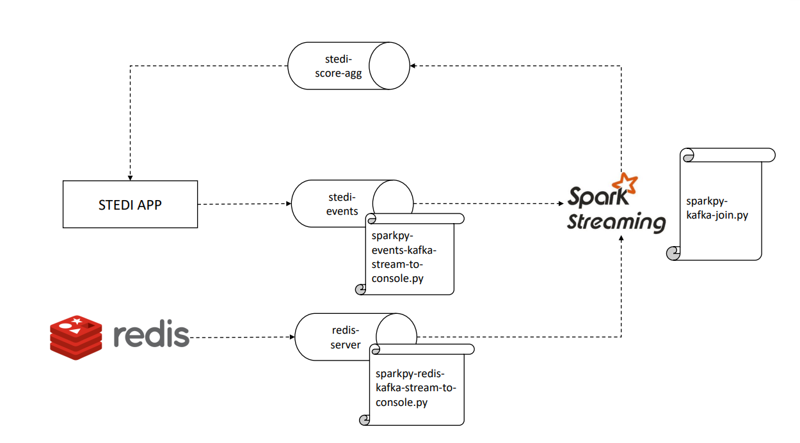

### Challenge

The product team wants to add a new feature to an existing application. This application is called STEDI and it collects data from seniors during a [small exercise](https://youtu.be/XosjuXTCGeg). After the exercise, the data transmitted enables the application to monitor seniors’ balance risk. 

The new feature consists of a graph that shows fail risk (will they fall and become injured?) for recent assessments by birth year.

To make this insightful data available in real-time, it will be necessary to get data about the users from a Redis database, which will be used as a Kafka source. In addition to this, whenever new data is prodocued by a user, a payload should be published to the Kafka topic redis-server as shown below:

```json
{"customer":"Jason.Mitra@test.com",
"score":7.0,
"riskDate":"2020-09-14T07:54:06.417Z"
}
```

Therefore, the technical challenge consists of generating a new payload in a Kafka topic using Spark Streaming to make the aggregated information for all the scores data available in the application. The data should be grouped by the birth year, which can be captured from Redis. The following image summarizes the architecture:



### Running the Application (test mode)

Please, scroll down to Running the Application (prod mode) for the definitive test.

**1. Use docker compose up file at the root of the repository to create 9 separate containers:**

- Redis
- Zookeeper (for Kafka)
- Kafka
- Banking Simulation
- Trucking Simulation
- STEDI (Application used in Final Project)
- Kafka Connect with Redis Source Connector
- Spark Master
- Spark Worker

This will also mounts your repository folder to the Spark Master and Spark Worker containers as a volume  `/home/workspace`, making your code changes instantly available within to the containers running Spark.

**2. Generate data using the STEDI app:**

- [Log-in](http://localhost:4567) to the STEDI application 
- Create a new account
- Creating a new customer
- Clicking start, then add steps until you reach 30 and the timer has stopped
- Repeating this four times, and you will receive a risk score


**3. Access Redis to checkout customers:** 

- Connect to the redis instance and retrieve the list of customers using:

```
docker exec -it 2evaluatehumanbalancewithsparkstreaming-redis-1 redis-cli
zrange customer 0 -1
```

**4. Access Kafka to checkout the topic redis-server in action:** 

- In another terminal run this command to start monitoring the kafka topic:

```
docker exec -it 2evaluatehumanbalancewithsparkstreaming-kafka-1 kafka-console-consumer --bootstrap-server localhost:9092 --topic redis-server
```

- Back in the redis-cli, type: 

```
zadd Customer 0 "{\"customerName\":\"Sam Test\",\"email\":\"sam.test@test.com\",\"phone\":\"8015551212\",\"birthDay\":\"2001-01-03\"}"
```

In the kafka consumer terminal you will see the following payload appear in the redis-server topic:

Formatted version of the payload:
```json
{"key":"__Q3VzdG9tZXI=__",
"existType":"NONE",
"Ch":false,
"Incr":false,
"zSetEntries":[{
"element":"__eyJjdXN0b21lck5hbWUiOiJTYW0gVGVzdCIsImVtYWlsIjoic2FtLnRlc3RAdGVzdC5jb20iLCJwaG9uZSI6IjgwMTU1NTEyMTIiLCJiaXJ0aERheSI6IjIwMDEtMDEtMDMifQ==__",
"Score":0.0
}],
"zsetEntries":[{
"element":"eyJjdXN0b21lck5hbWUiOiJTYW0gVGVzdCIsImVtYWlsIjoic2FtLnRlc3RAdGVzdC5jb20iLCJwaG9uZSI6IjgwMTU1NTEyMTIiLCJiaXJ0aERheSI6IjIwMDEtMDEtMDMifQ==",
"score":0.0
}]
}
```

By decoding (base64) the payload above, it should be possible to see the exact customer information in the element key values.

### Running the Application (prod mode)

Now, we will run the application as if it were a real app receiving lots of data. After kicking off docker-compose:

**1. Simulate receiving a lot of customer data:**

- [Log-in](http://localhost:4567) to the STEDI application 
- Click on "Activate Simulated User Data"


- To monitor the progress of data generated, from a terminal type: 

```
docker logs -f nd029-c2-apache-spark-and-spark-streaming_stedi_1
```

**2. Submitting the scripts:**

Before running the scripts, double check if the container name in the bash scripts is equal to the one of your kafka's broker by updating it in the .sh and .cmd files. You can access kafka's broker bash using:

```
docker exec -it 2evaluatehumanbalancewithsparkstreaming-kafka-1 bash
```