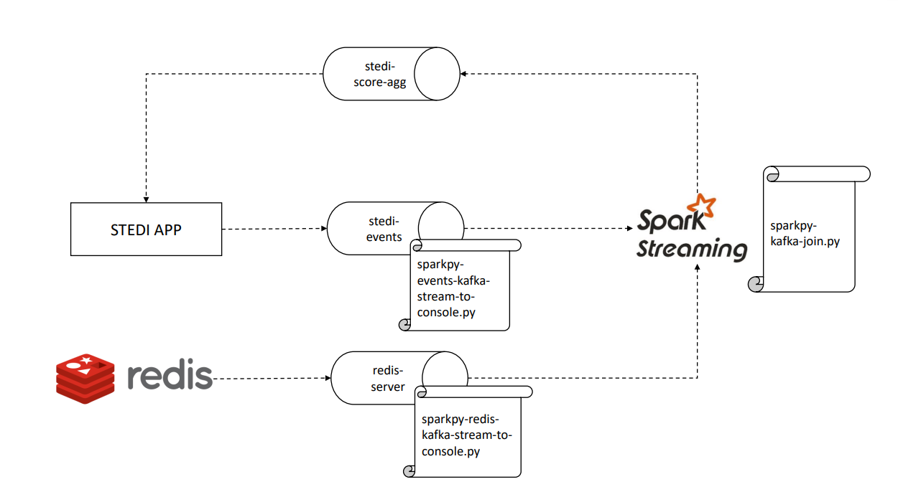
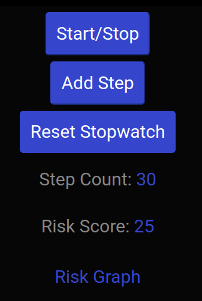

### Challenge

The product team wants to add a new feature to an existing application. This application is called STEDI and it collects data from seniors during a [small exercise](https://youtu.be/XosjuXTCGeg). After the exercise, the data transmitted enables the application to monitor seniors’ balance risk. 

The new feature consists of a graph that shows fail risk (will they fall and become injured?) for recent assessments by birth year.

To make this insightful data available in real-time, it will be necessary to get data about the users from a Redis database, which will be used as a Kafka source. In addition to this, whenever new data is prodocued by a user, a payload should be published to the Kafka topic redis-server as shown below:

```json
{
    "customer":"Jason.Mitra@test.com",
    "score":7.0,
    "riskDate":"2020-09-14T07:54:06.417Z"
}
```

Therefore, the technical challenge consists of generating a new payload in a Kafka topic using Spark Streaming to make the aggregated information for all the scores data available in the application. The data should be grouped by the birth year, which can be captured from Redis. The following image summarizes the architecture:



### Running the Application (test mode)

```Please, scroll down to Running the Application (prod mode) for the definitive test.```

**1. Use docker compose up file at the root of the repository to create 7 separate containers:**

- Redis
- Zookeeper (for Kafka)
- Kafka
- STEDI (Application used in Final Project)
- Kafka Connect with Redis Source Connector
- Spark Master
- Spark Worker

This will also mounts your repository folder to the Spark Master and Spark Worker containers as a volume  `/home/workspace`, making your code changes instantly available within to the containers running Spark.

**2. Generate data using the STEDI app:**

- [Log-in](http://localhost:4567) to the STEDI application 
- Create a new account
- Creating a new customer
- Clicking start, then add steps until you reach 30 and the timer has stopped
- Repeating this four times, and you will receive a risk score



**3. Access Redis to checkout customers:** 

- Connect to the redis instance and retrieve the list of customers using:

```
docker exec -it evaluate-human-balance-with-spark-streaming-redis-1 redis-cli
zrange Customer 0 -1
```

**4. Access Kafka to checkout the topic redis-server in action:** 

- In another terminal run this command to start monitoring the kafka topic:

```
docker exec -it valuate-human-balance-with-spark-streaming-kafka-1 kafka-console-consumer --bootstrap-server localhost:9092 --topic redis-server
```

- Back in the redis-cli, type: 

```
zadd Customer 0 "{\"customerName\":\"Sam Test\",\"email\":\"sam.test@test.com\",\"phone\":\"8015551212\",\"birthDay\":\"2001-01-03\"}"
```

In the kafka consumer terminal you will see the following payload appear in the redis-server topic:

Formatted version of the payload:
```json
{
    "key":"__Q3VzdG9tZXI=__",
    "existType":"NONE",
    "Ch":false,
    "Incr":false,
    "zSetEntries":[
        {
        "element":"__eyJjdXN0b21lck5hbWUiOiJTYW0gVGVzdCIsImVtYWlsIjoic2FtLnRlc3RAdGVzdC5jb20iLCJwaG9uZSI6IjgwMTU1NTEyMTIiLCJiaXJ0aERheSI6IjIwMDEtMDEtMDMifQ==__",
        "Score":0.0
        }
    ],
    "zsetEntries":[
        {
        "element":"eyJjdXN0b21lck5hbWUiOiJTYW0gVGVzdCIsImVtYWlsIjoic2FtLnRlc3RAdGVzdC5jb20iLCJwaG9uZSI6IjgwMTU1NTEyMTIiLCJiaXJ0aERheSI6IjIwMDEtMDEtMDMifQ==",
        "score":0.0
        }
    ]
}
```

By decoding (base64) the payload above, it should be possible to see the exact customer information in the element key values, such as:

```
"element":"{
    "customerName":"Sam Test",
    "email":"sam.test@test.com",
    "phone":"8015551212",
    "birthDay":"2001-01-03"
    }"
```

### Running the Application (prod mode)

Now, we will run the application as if it were a real app receiving lots of data. After kicking off docker-compose:

**1. Simulate receiving a lot of customer data:**

- [Log-in](http://localhost:4567) to the STEDI application 
- Click on "Activate Simulated User Data"


- To monitor the progress of data generated, from a terminal type: 

```
docker logs -f evaluate-human-balance-with-spark-streaming-stedi-1
```

**2. Submitting the scripts:**

The .sh and .cmd scripts will run the python scripts and automatically generate a log file for them. Before running the scripts, double check if the container name inside them is equal to the one of your kafka's broker by updating it in the .sh and/or .cmd files. 

To watch the data arriving to the stedi-score-agg topic after submitting the scripts, you can access kafka's broker bash using:

```
docker exec -it evaluate-human-balance-with-spark-streaming-kafka-1 bash
```

Now that we are inside the broker, you can run the following commands to start consuming and displaying messages from the stedi-score-agg topic (or any other topic) on the console for testing purposes. At this point, all the topics except stedi-score-agg should be receiving data automatically.

```
kafka-console-consumer --bootstrap-server localhost:9092 --topic stedi-score-agg
```

Needless to say, you should get inside the container before running the script to see the logs in real time. 

For debugging purposes, it is also possible to run the following command to get all the messages inside the topic and check if anything has ever arrived there:

```
kafka-console-consumer --bootstrap-server localhost:9092 --topic redis-server --from-beginning
```

And the following one for cleaning the topic:
```
kafka-topics --bootstrap-server localhost:9092 --delete --topic redis-server
kafka-topics --bootstrap-server localhost:9092 --create --topic redis-server --partitions 1 --replication-factor 1

```

Now, feel free to submit the PySpark scripts below. The first 2 scripts are only used to display messages in the console for debugging purposes. The last script combines the two previous one and writes the data to the topic instead of printing it on the console:

 - `sparkpy-redis-kafka-stream-to-console.py` to subscribe to the `redis-server` topic, base64 decode the payload, and deserialize the JSON to individual fields, then print the fields to the console. The data should include the birth date and email address. 
- `sparkpy-events-kafka-stream-to-console.py` to subscribe to the `stedi-events` topic and deserialize the JSON (it is not base64 encoded) to individual fields. 
- `sparkpy-kafka-join.py` to join the customer dataframe and the customer risk dataframes, joining on the email address. It also creates a JSON output to the newly created kafka topic:

```json
{
    "customer":"Santosh.Fibonnaci@test.com",
    "score":"28.5",
    "email":"Santosh.Fibonnaci@test.com",
    "birthYear":"1963"
} 
```

To run them, input on separate terminals:

1. .\submit-event-kafkastreaming.sh (or submit-event-kafkastreaming.cmd)
2. .\submit-redis-kafka-streaming.sh (or submit-redis-kafka-streaming.cmd)
3. .\submit-event-kafkajoin.sh (or submit-event-kafkastreaming.cmd) 

The logs can be checked respectively under:
1. spark/logs/eventstream.log
2. spark/logs/redis-kafka.log
3. spark/logs/kafkajoin.log

To get additional logs for the spark master and workers, input:

```
docker logs evaluate-human-balance-with-spark-streaming-spark-1 > ../../spark/logs/spark-master.log
docker logs evaluate-human-balance-with-spark-streaming-spark-worker-1-1 > ../../spark/logs/spark-worker.log
```

And the results should look like as follows:


**3. Checking the new feature chart:** 

Go back to the initial app screen and check-out the chart being updated almost near real-time while it consumes from the stedi-score-agg topic:

Example #1 


Example #2


