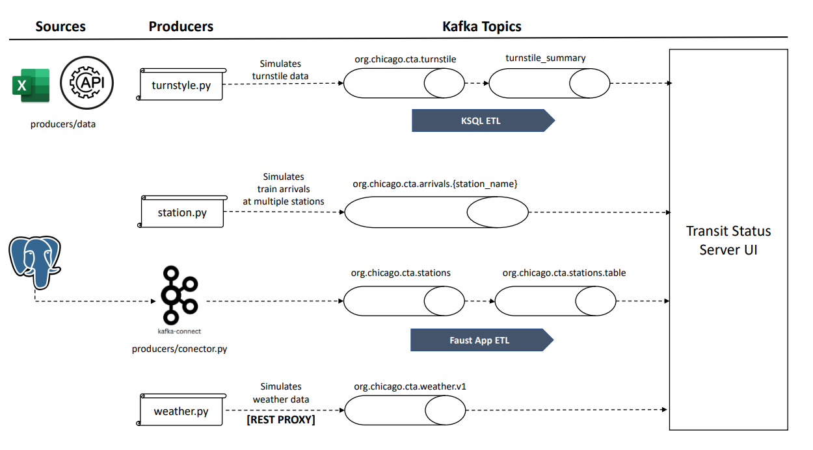
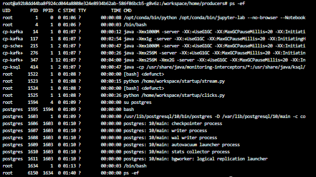
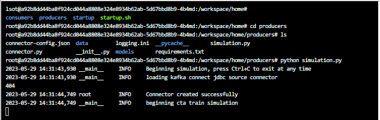
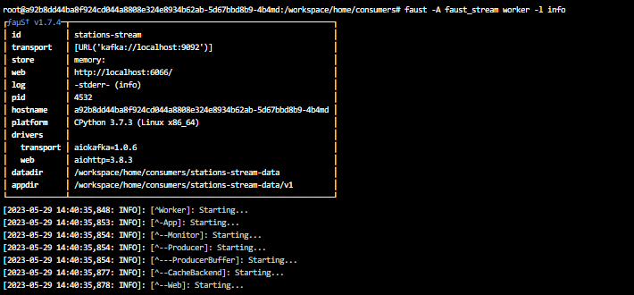
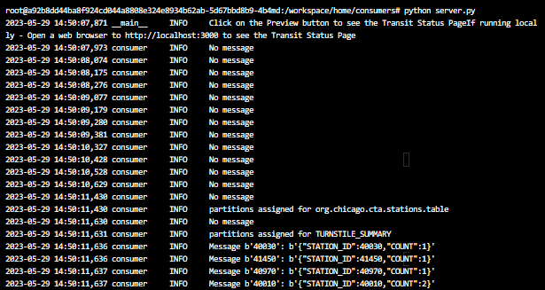

### Challenge

To construct a streaming event pipeline around Apache Kafka and its ecosystem. Using public data from the [Chicago Transit Authority](https://www.transitchicago.com/data/) to display the status of train lines in real time. The final application should display information as exemplified below:


To make the information available on the UI, it is first required to develop the following architecture:


- **Kafka Connect** is used to facilitate the integration with the PostgresDB that is used by the Chicago Transit Authorit.
- **REST Proxy** is used because the Weather application in which we will be retrieving data from is a legacy application that doesn't have a Kafka Conenctor available.
- **KSQL** is the SQL-like Stream Processing Frameowkr that can be used for simple stream processing tasks, such as filtering, aggregating and joining streams of data with ease of use and minimal coding.
- **Faust** is the default Stream Processing Framework for creating pipelines, ingesting, and transforming data in Kafka using Python to enhance and custom the streaming process when more complex requirements are in place.

The detailed architecture at the topic level can be seen below:




### Running the Application

The application can be run in your own machine using the Host URL directly in Udacity Workspace or using the Docker URL when running via Docker. When configuring services that run within Docker-Compose, like Kafka Connect, you must use the Docker URL. When you configure the JDBC Source Kafka Connector, for example, you will want to use the value from the Docker URL column.


To start the simulation, it is critical to open a terminal window for each piece of the code and run both producers and consumers the same time. Before that, it is worth double checking if all the services are active in docker compose by running a docker ps or ps -ef when using Linux. The following print exemplifies the list of processes running on Linux.

In case Postgres services are not listed, it is possible to start them manually running:

```
su postgres
/usr/lib/postgresql/10/bin/pg_ctl start -D /var/lib/postgresql/10/main -l /var/log/postgresql/postgresql-10-main.log -s -o '-c config_file="/etc/postgresql/10/main/postgresql.conf"'
````



In this case, it will be also necessary to create a postgres user and database manually:

**Creating the postgres user**
```
1. su postgres
2. psql
3. CREATE USER cta_admin WITH PASSWORD 'chicago';
4. ALTER USER cta_admin WITH SUPERUSER;
5. SELECT usename FROM pg_user;
6. \q
```

**Creating tables**
```
1. createdb classroom
2. psql -d classroom -c "DROP TABLE IF EXISTS purchases; CREATE TABLE purchases(id INT PRIMARY KEY, username VARCHAR(100), currency VARCHAR(10), amount INT);"
3. psql -d classroom -c "DROP TABLE IF EXISTS clicks; CREATE TABLE clicks(id INT PRIMARY KEY, email VARCHAR(100), timestamp VARCHAR(100), uri VARCHAR(512), number INT);"
4. psql -d classroom -c "DROP TABLE IF EXISTS connect_purchases; CREATE TABLE connect_purchases(id INT PRIMARY KEY, username VARCHAR(100), currency VARCHAR(10), amount INT);"
5. psql -d classroom -c "DROP TABLE IF EXISTS connect_clicks; CREATE TABLE connect_clicks(id INT PRIMARY KEY, email VARCHAR(100), timestamp VARCHAR(100), uri VARCHAR(512), number INT);"
6. psql -d classroom -c "COPY purchases(id,username,currency,amount)  FROM '/home/workspace/startup/purchases.csv' DELIMITER ',' CSV HEADER;"
7. psql -d classroom -c "COPY clicks(id,email,timestamp,uri,number)  FROM '/home/workspace/startup/clicks.csv' DELIMITER ',' CSV HEADER;"
8. createdb cta
9. psql -d cta -c "CREATE TABLE stations (stop_id INTEGER PRIMARY KEY, direction_id VARCHAR(1) NOT NULL, stop_name VARCHAR(70) NOT NULL, station_name VARCHAR(70) NOT NULL, station_descriptive_name VARCHAR(200) NOT NULL, station_id INTEGER NOT NULL, \"order\" INTEGER, red BOOLEAN NOT NULL, blue BOOLEAN NOT NULL, green BOOLEAN NOT NULL);"
10. psql -d cta -c "COPY stations(stop_id, direction_id,stop_name,station_name,station_descriptive_name,station_id,\"order\",red,blue,green) FROM '/home/workspace/startup/cta_stations.csv' DELIMITER ',' CSV HEADER;"

```

Now, consider the following **configuration commands** to be run before each application:
```
- virtualenv venv
- . venv/bin/activate
- pip install -r requirements.txt
```

**1. Kick-off the Producers:** this will trigger the script that creates simulated weather data to be ingested.

- run the configuration commands mentioned above in the directory of the file below
- run python simulation.py

You should be able to see the following message on the terminal:



**2. Start the Faust Stream Processing App:** this will start the ETL from the topic "chicago.arrivals.{station_name}" and sink it into "org.chicago.cta.stations.table"

- run the configuration commands mentioned above in the directory of the file below
- run faust -A faust_stream worker -l info

The following message should appear on the terminal:





**3. Run the KSQL Creation Script:** to create the tables to be consumed by the final application.

- run the configuration commands mentioned above in the directory of the file below
- run python ksql.py

Nothing is expected to show on the terminal this time as we are just executing SQL statements.


**4. Start the Consumer (Dashboard Server):** so the Dashboard can start consuming information from the topics and display table data in the UI.

- run the configuration commands mentioned above in the directory of the file below
- run python server.py



